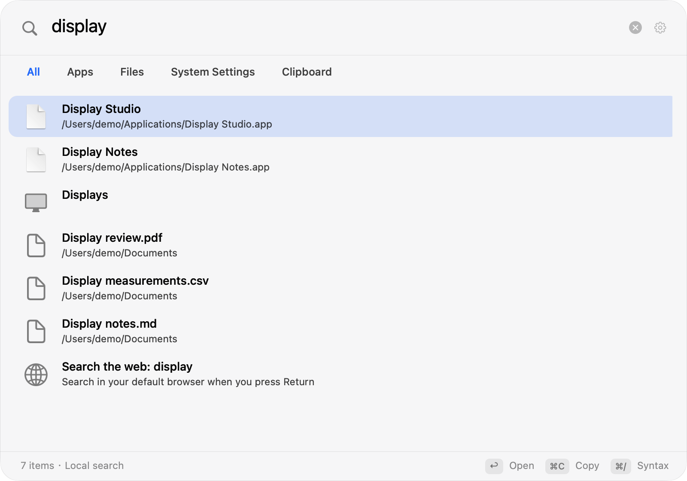
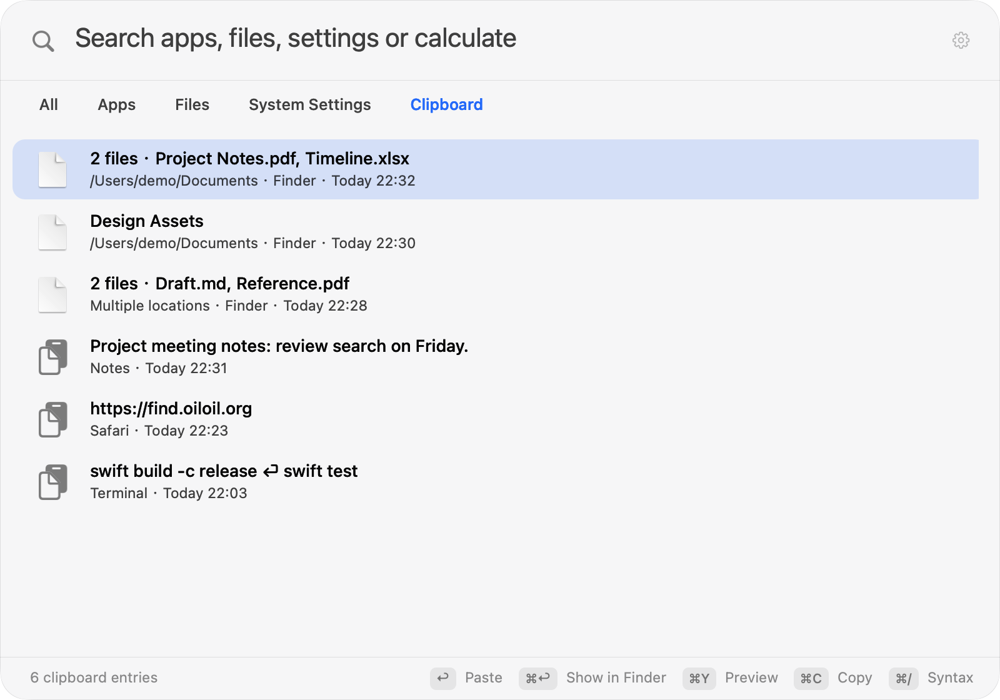

<p align="center">
  <a href="https://github.com/oil-oil/oil-find/releases/latest"><b>Download</b></a>
  &nbsp;·&nbsp;
  <a href="https://find.oiloil.org/en">Website</a>
  &nbsp;·&nbsp;
  <a href="./README.md">中文</a>
</p>

Oil Find is a native macOS search panel. Press ⌘Space by default. If that shortcut cannot register because of Spotlight, the app temporarily tries ⇧⌘F and provides a Spotlight settings link, directions and retry in Settings. You can also turn off the Spotlight search shortcut in System Settings → Keyboard → Keyboard Shortcuts → Spotlight. Upgrades preserve an existing custom shortcut.

File search uses its own on-disk file-name index instead of Spotlight. Results update as you type, and file creation, renaming and deletion are reflected in the index. You can also switch to apps, settings, clipboard history and offline calculations.

## File search

- **File names live in one contiguous block of memory.** Hundreds of thousands of names are stored column by column and scanned front to back, with no per-file objects.
- **Matching runs in C with NEON.** Character comparisons use Apple silicon's vector instructions in batches.
- **Results narrow incrementally.** Typing one more character only searches what already matched.
- **Only changes get updated.** FSEvents reports what changed and the index is updated incrementally. After a restart, Oil Find catches up from where it left off.

Dependency folders, app and package internals, Library and system folders are excluded by default. You can adjust the index scope in Settings. File search supports pinyin, name and path conditions, wildcards, and kind, size and modification-date filters.

## Other search scopes

The panel offers All, Apps, Files, Settings and Clipboard scopes, switchable with ⌘0…⌘4. Use ⌥⌘1…9 for file-type filters. File results retain Quick Look, path copying, Finder reveal and drag-and-drop.



Clipboard history is off by default and starts recording only after you first enable it. It records text, links and path references to local files and folders. Upgrades preserve your enabled state and preferences, and existing text history remains compatible. A group of files copied in Finder becomes one history entry; the list shows names and a count, and you can search by file name or path.

Select a file history entry and press ⌘C to restore the whole group as file URLs on the system clipboard, then return to Finder and press ⌘V to copy the files. Return attempts to paste directly after checking the original target app, focus and Accessibility permission; if a check fails, the entry is only copied to the system clipboard and the app tells you. History stores paths without backing up files or reading their contents. Files moved or deleted from those paths cannot be recovered from history. Before copying, the app checks every file in the group on a background queue. A missing path or a two-second deadline preserves the current clipboard. Changing the query, selected entry or panel state cancels the pending action before any write.

Default retention is 7 days and up to 500 entries, configurable to 1–365 days and 1–10,000 entries. Each text entry is limited to 256 KiB in UTF-8. Each file entry allows up to 1,000 paths with a combined UTF-8 size of at most 256 KiB. Total history storage remains limited to 32 MiB. History, including file path references, is encrypted locally and protected with Keychain. Password managers are excluded by default; you can exclude other source apps, pause capture or clear history. Image content, file promises whose contents have not yet been generated, and items marked concealed, transient or autogenerated are not captured.

If Keychain access fails, the original encrypted file is preserved, new entries stay in memory, and Settings shows the storage error. Click “Authorize History Storage” to request system authorization. After the original history loads successfully, it is merged with current entries and saved; failed authorization never overwrites the original file.



Expression calculations and unit conversions work offline. Enter a URL to open it. DuckDuckGo is the default web search engine, with Google and Bing as options. Choose a web result for a regular query or enter `web:` to request web search explicitly; the browser opens only when you activate that result. Typing does not send queries to a search engine.

## Search syntax

| Type | Meaning |
| --- | --- |
| `wd`, `wendang` | Pinyin initials or full pinyin, finds 文档 |
| `foo bar` | Contains both foo and bar |
| `foo \| bar` | Contains foo or bar |
| `readme !node_modules` | Contains readme, not inside node_modules |
| `*.png` | Wildcards match the whole name |
| `~/Desktop/ png` | Only under the Desktop |
| `ext:pdf;docx` | By extension |
| `kind:image` | By kind: folder, app, doc, image, video, audio, code, archive |
| `file:`, `folder:` | Files only, or folders only |
| `size:>10mb`, `size:1mb..5mb` | By size |
| `dm:today`, `dm:week`, `dm:2026-10-01` | By modification date |
| `regex:^IMG_\d+` | Regular expressions |

You can paste paths straight from a terminal or editor: `file://` URLs, quoted or escaped paths and paths ending in `:line:column` all work. Press ⌘/ in the search field for a syntax reference.

## Keyboard

| Key | Action |
| --- | --- |
| <kbd>⌘</kbd><kbd>Space</kbd> | Open search (default) |
| <kbd>⇧</kbd><kbd>⌘</kbd><kbd>F</kbd> | Temporary fallback if ⌘Space cannot register |
| <kbd>⌘</kbd><kbd>0</kbd>…<kbd>4</kbd> | Switch All, Apps, Files, Settings and Clipboard scopes |
| <kbd>⌥</kbd><kbd>⌘</kbd><kbd>1</kbd>…<kbd>9</kbd> | Choose file type |
| <kbd>Return</kbd> | Execute the result: open, copy a calculation, or paste a clipboard entry |
| <kbd>⌘</kbd><kbd>Return</kbd> | Files: show in Finder |
| <kbd>⌘</kbd><kbd>Y</kbd> | Files: Quick Look; clipboard: multiline preview |
| <kbd>⌘</kbd><kbd>C</kbd> | Copy selected query text first, otherwise the result's path, text or URL; file clipboard entries restore the whole group as file URLs |
| <kbd>⌥</kbd><kbd>⌘</kbd><kbd>C</kbd> | Files: copy name |
| <kbd>⌘</kbd><kbd>⌫</kbd> | Files: move to Trash; clipboard: delete the history entry |
| <kbd>Tab</kbd> | Cycle file types in the Files scope |
| <kbd>⌘</kbd><kbd>/</kbd> | Syntax reference |

You can also drag results into other apps.

## Install

1. Download `Oil-Find.zip` from [Releases](https://github.com/oil-oil/oil-find/releases/latest), unzip it and drag Oil Find into Applications.
2. The first time you open it, macOS blocks it because it isn't notarized by Apple. Go to System Settings → Privacy & Security and click Open Anyway near the bottom.
3. Press ⌘Space and start typing. If the shortcut cannot register, the app temporarily tries ⇧⌘F. You can adjust the Spotlight shortcut in System Settings as described above, then retry from Oil Find's Settings.
4. Optional: grant Full Disk Access to also search mail attachments and other apps' data. Oil Find works fine without it.

When a new version is out, Oil Find tells you; click Update and Restart. You can turn off automatic checks in Settings.

Source users can run `scripts/uninstall.sh` to remove the app, index, clipboard history, preferences and clipboard encryption key after confirmation. For manual removal, quit Oil Find and delete the app from Applications and `~/Library/Application Support/Oil Find`; also remove the `com.oiloil.find.clipboard-history` Keychain item if desired.

## Build from source

The app runs on macOS 14 or later. Source builds require Xcode with macOS SDK 15.4 or later; CI uses Xcode 16.4 (macOS 15.5 SDK). The project retains Swift 5 language mode and a macOS 14 deployment target.

```sh
git clone https://github.com/oil-oil/oil-find.git
cd oil-find
swift test
scripts/build-app.sh   # builds build/Oil Find.app
scripts/install.sh     # builds and installs into Applications
```

Without a stable signing identity, source builds are ad-hoc signed. Rebuilding may require granting Full Disk Access and access to an existing clipboard key again. If Clipboard Settings shows a storage error, click “Authorize History Storage” and complete the macOS Keychain prompt manually. Failed authorization preserves the original encrypted history; new entries remain in memory.

Before submitting a PR, run `scripts/verify-release-app.sh "build/Oil Find.app"` to check the release bundle. `scripts/verify-clipboard-upgrade.sh` uses an isolated keychain and a temporary stable signing identity to verify real encrypted history across shutdown and upgrades, without accessing the user's history. `scripts/compare-engine-performance.py` compares release file engines; see the [validation record](./docs/SPOTLIGHT_VALIDATION.md) for usage and measurement limits.

## Privacy

- The file-search engine reads file names, sizes and modification dates only, never file contents. Its index stays on your Mac in `~/Library/Application Support/Oil Find/`.
- Clipboard history is off by default. When enabled, it saves text, links and local file/folder path references, encrypted locally and protected with Keychain. File references store paths without reading contents or backing up files. You can pause, clear it or exclude source apps; upgrades preserve your enabled state and preferences.
- The frontmost app at copy time approximates the source; exclusions cannot identify every sensitive item. If the key is unavailable or the archive is corrupt, the original file is preserved, an error is shown, and new entries stay in memory.
- Web search opens only after you choose an engine and submit. Typing does not connect to a search engine or send the query.
- App network use includes a user-submitted web search and the update check. The update check fetches one version file without device or usage data and can be disabled in Settings.

## Current limits

- Apple silicon and macOS 14 or later only.
- External drives and network volumes aren't indexed yet.
- The file index searches names, not file contents. Clipboard history is a separate opt-in feature; file entries store path references only. Moved or deleted paths cannot be recovered. If any path in the group is missing, the current clipboard is preserved and you need to copy the files again.

## Project layout

| Folder | Contents |
| --- | --- |
| `Sources/COilFind` | C: batched directory reads, name comparison, search scoring |
| `Sources/OilFindCore` | Scanning, indexing, file queries, live updates, persistence and app updates |
| `Sources/OilFind` | AppKit app, search panel, cross-source coordinator, clipboard and system integration |
| `Sources/oilfind-cli` | Command-line tool for benchmarks and troubleshooting |
| `site` | The website, [find.oiloil.org](https://find.oiloil.org/en) |

See [docs/ARCHITECTURE.md](./docs/ARCHITECTURE.md) for the index design and [AGENTS.md](./AGENTS.md) for development conventions. Issues and pull requests are welcome.

See [docs/SPOTLIGHT_VALIDATION.md](./docs/SPOTLIGHT_VALIDATION.md) for this extension's automated, performance and hardware validation scope.

## License

[MIT](./LICENSE)
