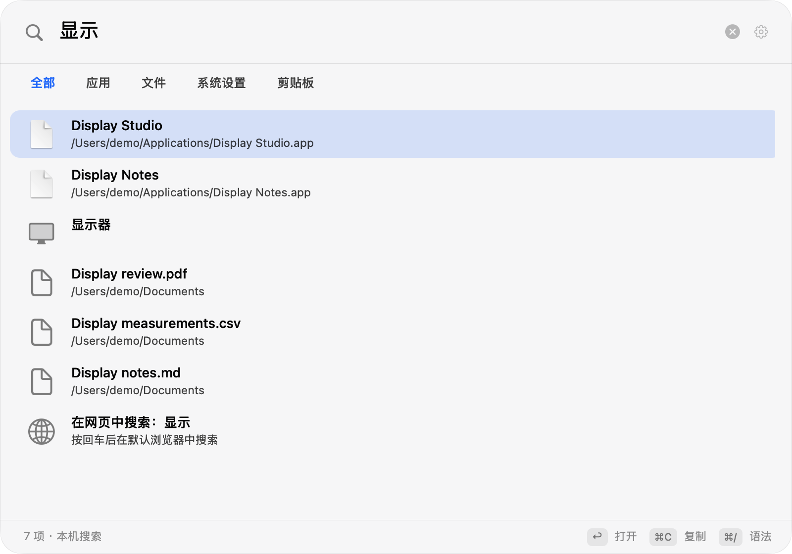
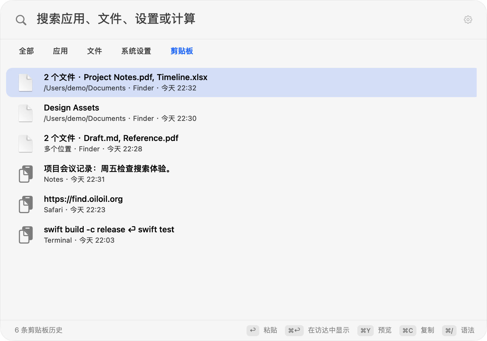

<p align="center">
  
</p>

<p align="center">
  <a href="https://github.com/oil-oil/oil-find/releases/latest"><b>下载</b></a>
  &nbsp;·&nbsp;
  <a href="https://find.oiloil.org">官网</a>
  &nbsp;·&nbsp;
  <a href="./README.en.md">English</a>
</p>

Oil Find 是 macOS 原生搜索面板。默认按 ⌘Space 打开；如果该快捷键因 Spotlight 冲突而注册失败，应用会临时尝试 ⇧⌘F，并在设置中提供 Spotlight 系统快捷键设置入口、路径提示和重试。你也可以在「系统设置 → 键盘 → 键盘快捷键 → Spotlight」关闭 Spotlight 搜索快捷键。升级时会保留你已有的自定义快捷键。

文件搜索使用自己的磁盘文件名索引，不依赖 Spotlight。输入时结果随之更新，文件的新建、改名和删除会更新索引。还可以切换到应用、设置、剪贴板历史和离线计算。

## 文件搜索

- **文件名放在一块连续的内存里。** 几十万个名称按列存放，搜索时从头到尾扫一遍，不给每个文件单独创建对象。
- **匹配交给 C 和 NEON。** 字符比较用 Apple 芯片的向量指令批量完成。
- **增量收窄结果。** 每多打一个字，只在上一次的结果里继续找。
- **只更新变化的部分。** 通过 FSEvents 监听文件变化，增量更新索引；应用重启后从上次停下的位置接着补齐。

默认不深入开发依赖目录、应用包内部、资源库和系统目录；可在设置里调整索引范围。文件搜索支持拼音、名称与路径条件、通配符、类型、大小和修改时间筛选。

## 其他搜索范围

搜索面板提供「全部、应用、文件、设置、剪贴板」范围，按 ⌘0…⌘4 切换；文件类型筛选使用 ⌥⌘1…9。文件结果保留 Quick Look 预览、路径复制、访达定位与拖放操作。



剪贴板历史默认关闭，仅在首次启用后开始记录文本、链接，以及本地文件和文件夹的路径引用。升级保留已有开启状态和偏好，已有文本历史仍可使用。从 Finder 复制的一组文件会保存为一条历史，列表显示名称和数量，可按文件名或路径搜索。

选中文件历史项后按 ⌘C，会把整组文件恢复为系统剪贴板上的文件 URL；回到 Finder 按 ⌘V 即可复制文件。按 Return 会在检查原目标应用、焦点和辅助功能权限后尝试直接粘贴；检查失败时仅复制到系统剪贴板并提示。历史只保存路径，不备份或读取文件正文；文件移动或删除后无法从历史恢复。恢复复制前在后台检查整组文件是否仍存在；任一路径失效或检查超过 2 秒时，保留当前剪贴板并提示。等待期间修改查询、切换选中项或关闭面板，会在写入前取消旧操作。

默认保留 7 天、最多 500 条；可分别调整为 1…365 天和 1…10,000 条。单条文本的 UTF-8 大小最多 256 KiB；单条文件记录最多 1,000 个路径，所有路径的 UTF-8 总大小最多 256 KiB。历史总量最多 32 MiB，包含文件路径引用的数据在本机加密，并由钥匙串保护。默认排除密码管理器，也可排除其他来源应用；可暂停记录或清空历史。图片内容、文件承诺中尚未生成的内容，以及标记为敏感、临时或自动生成的剪贴板项目不会采集。

钥匙串访问失败时保留原加密文件，新记录暂存内存，设置中显示保存错误。点击「授权保存历史」后才会请求系统授权；成功读取原历史后，与当前内存记录合并保存。授权失败时继续保留原文件，不覆盖已有历史。



表达式计算和单位换算离线完成。输入网址可打开该网址；网页搜索默认 DuckDuckGo，可选 Google 或 Bing。普通查询可选择网页搜索结果，或用 `web:` 明确搜索；只有执行该结果时才会打开搜索引擎，输入过程中不会发送查询内容。

## 搜索语法

| 输入 | 意思 |
| --- | --- |
| `wd`、`wendang` | 拼音首字母或全拼，能找到「文档」 |
| `foo bar` | 同时包含 foo 和 bar |
| `foo \| bar` | 包含 foo 或 bar |
| `readme !node_modules` | 包含 readme，排除 node_modules 里的 |
| `*.png` | 通配符，匹配整个名称 |
| `~/Desktop/ png` | 只在桌面下面找 |
| `ext:pdf;docx` | 按扩展名 |
| `kind:image` | 按类型：folder、app、doc、image、video、audio、code、archive |
| `file:`、`folder:` | 只要文件，或只要文件夹 |
| `size:>10mb`、`size:1mb..5mb` | 按大小 |
| `dm:today`、`dm:week`、`dm:2026-10-01` | 按修改时间 |
| `regex:^IMG_\d+` | 正则表达式 |

从终端或编辑器复制来的路径可以直接粘贴：`file://` 链接、带引号或转义的路径、末尾带 `:行:列` 的路径都能识别。在搜索框里按 ⌘/ 可以随时打开语法速查。

## 键盘操作

| 按键 | 作用 |
| --- | --- |
| <kbd>⌘</kbd><kbd>Space</kbd> | 打开搜索（默认） |
| <kbd>⇧</kbd><kbd>⌘</kbd><kbd>F</kbd> | ⌘Space 注册失败时临时尝试的回退键 |
| <kbd>⌘</kbd><kbd>0</kbd>…<kbd>4</kbd> | 切换全部、应用、文件、设置、剪贴板范围 |
| <kbd>⌥</kbd><kbd>⌘</kbd><kbd>1</kbd>…<kbd>9</kbd> | 选择文件类型 |
| <kbd>Return</kbd> | 执行结果：打开、复制计算结果，或粘贴剪贴板条目 |
| <kbd>⌘</kbd><kbd>Return</kbd> | 文件：在访达中显示 |
| <kbd>⌘</kbd><kbd>Y</kbd> | 文件：Quick Look；剪贴板：多行预览 |
| <kbd>⌘</kbd><kbd>C</kbd> | 优先复制选中文字，否则复制当前结果的路径、文本或网址；文件剪贴板历史项恢复整组文件 URL |
| <kbd>⌥</kbd><kbd>⌘</kbd><kbd>C</kbd> | 文件：拷贝名称 |
| <kbd>⌘</kbd><kbd>⌫</kbd> | 文件：移到废纸篓；剪贴板：删除该条历史 |
| <kbd>Tab</kbd> | 在文件范围内切换文件类型 |
| <kbd>⌘</kbd><kbd>/</kbd> | 语法速查 |

结果也可以直接拖到别的应用里。

## 安装

1. 从 [Releases](https://github.com/oil-oil/oil-find/releases/latest) 下载 `Oil-Find.zip`，解压后把 Oil Find 拖进「应用程序」。
2. 第一次打开时，macOS 会拦下来，因为它没有经过 Apple 公证。到「系统设置 → 隐私与安全性」，在页面下方点「仍要打开」。
3. 按 ⌘Space 开始搜索。如果快捷键注册失败，应用会临时尝试 ⇧⌘F；你也可以按上方说明调整 Spotlight 系统快捷键设置后，在应用设置中重试。
4. 可选：授予「完全磁盘访问权限」后，邮件附件和其他应用的数据也能搜到。不授予也能正常使用。

有新版本时，Oil Find 会提示你，点「更新并重启」就行。自动检查可以在设置里关掉。

源码用户可运行 `scripts/uninstall.sh`，确认后删除应用、本地索引、剪贴板历史、偏好设置及剪贴板加密密钥。手动卸载时退出应用并删除「应用程序」里的 Oil Find 和 `~/Library/Application Support/Oil Find`；钥匙串中的 `com.oiloil.find.clipboard-history` 项可一并删除。

## 从源码构建

应用运行需要 macOS 14 或更新版本。源码构建需要包含 macOS 15.4 或更新 SDK 的 Xcode；CI 使用 Xcode 16.4（macOS 15.5 SDK），项目保持 Swift 5 语言模式和 macOS 14 部署目标。

```sh
git clone https://github.com/oil-oil/oil-find.git
cd oil-find
swift test
scripts/build-app.sh   # 生成 build/Oil Find.app
scripts/install.sh     # 构建并安装到「应用程序」
```

未配置稳定签名身份时，自己构建的应用使用临时签名；重新构建后可能需要再次授予完全磁盘访问权限和旧剪贴板密钥访问权限。若剪贴板设置显示保存错误，点击「授权保存历史」并手动完成 macOS 钥匙串授权。原加密历史在授权失败时保留，新增内容暂存内存。

提交 PR 前可运行 `scripts/verify-release-app.sh "build/Oil Find.app"` 检查正式产物。`scripts/verify-clipboard-upgrade.sh` 使用隔离钥匙串和临时稳定签名，验证真实加密历史在退出和升级后恢复；不使用或修改用户的剪贴板历史。引擎对照脚本为 `scripts/compare-engine-performance.py`，运行方法和测量边界见 [验收记录](./docs/SPOTLIGHT_VALIDATION.md)。

## 隐私

- 文件搜索引擎仅读取文件名、大小和修改时间，不读取文件内容；索引保存在本机的 `~/Library/Application Support/Oil Find/`。
- 剪贴板历史默认关闭；启用后保存文本、链接和本地文件/文件夹路径引用，在本机加密并由钥匙串保护。文件引用只保存路径，不读取正文或备份文件。可暂停、清空或排除来源应用，升级保留已有开启状态和偏好。
- 来源应用按复制时的前台应用估计，无法保证识别所有敏感内容。密钥不可用或历史损坏时保留原文件并显示错误，新内容暂存内存。
- 网页搜索默认 DuckDuckGo，也可选择 Google 或 Bing。普通查询会提供网页搜索候选，输入 `web:` 可明确请求搜索；只有用户执行该候选时才打开搜索引擎。输入过程中不联网、不发送查询内容。
- 应用会在用户发起网页搜索时打开所选网站；版本检查只请求版本信息文件，不附带设备或使用数据，可在设置里关闭。

## 目前的限制

- 只支持 Apple 芯片和 macOS 14 及以上。
- 外置磁盘和网络卷暂时搜不到。
- 文件索引搜索文件名，不搜索文件内容；剪贴板历史是独立的可选功能，文件记录只保存路径引用。路径移动或删除后无法恢复；整组路径检查失败时保留当前剪贴板，需重新复制文件。

## 项目结构

| 目录 | 内容 |
| --- | --- |
| `Sources/COilFind` | C 代码：批量读取目录、名称比较、搜索评分 |
| `Sources/OilFindCore` | 扫描、索引、文件查询、实时更新、持久化与应用更新 |
| `Sources/OilFind` | AppKit 应用、搜索面板、跨来源协调器、剪贴板与系统集成 |
| `Sources/oilfind-cli` | 命令行工具，用来测速和排查问题 |
| `site` | 官网 [find.oiloil.org](https://find.oiloil.org) |

索引的数据结构和设计约束见 [docs/ARCHITECTURE.md](./docs/ARCHITECTURE.md)，开发约定见 [AGENTS.md](./AGENTS.md)。欢迎提 Issue 和 Pull Request。

本次扩展的自动化、性能及真机验证范围见 [docs/SPOTLIGHT_VALIDATION.md](./docs/SPOTLIGHT_VALIDATION.md)。

## 许可证

[MIT](./LICENSE)
