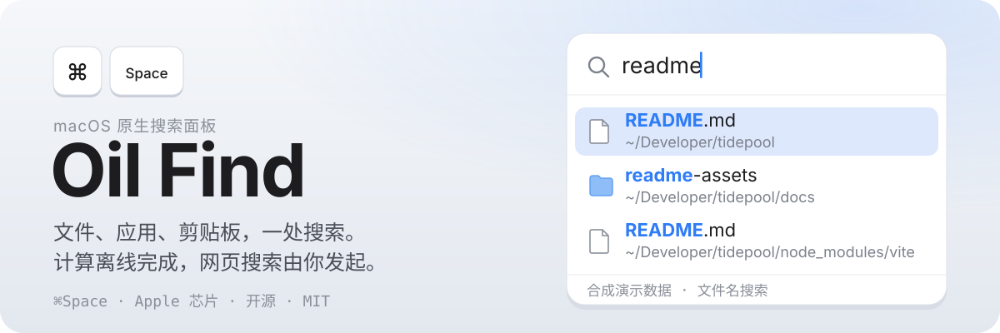

<p align="center">
  
</p>

<p align="center">
  <a href="https://github.com/oil-oil/oil-find/releases/latest"><b>下载</b></a>
  &nbsp;·&nbsp;
  <a href="https://find.oiloil.org">官网</a>
  &nbsp;·&nbsp;
  <a href="./README.en.md">English</a>
</p>

<p align="center">
<picture>
  <source media="(prefers-color-scheme: dark)" srcset="./assets/readme/search-zh-dark.png">
  
</picture>
</p>

Oil Find 是 macOS 上的文件搜索工具，思路和 Windows 上的 Everything 一样：自己给磁盘上的文件名建一份内存索引，不依赖 Spotlight。按 ⇧⌘F，屏幕正中弹出搜索框，每打一个字，结果就跟着出来；文件新建、改名、删除，索引都会实时更新。

## 为什么快

- **文件名放在一块连续的内存里。** 几十万个名称按列存放，搜索时从头到尾扫一遍，不给每个文件单独创建对象。
- **匹配交给 C 和 NEON。** 字符比较用 Apple 芯片的向量指令批量完成。
- **越打越窄。** 每多打一个字，只在上一次的结果里继续找。
- **只更新变化的部分。** 通过 FSEvents 监听文件变化，增量更新索引；应用重启后从上次停下的位置接着补齐。

下面是在一台 Apple M5（24 GB 内存）上，用仓库自带的命令行工具实测的结果，每条查询跑 20 次取中位数：

| 索引范围 | 文件数 | 建索引 | 常驻内存 | `readme` | `wd`（拼音） | `kind:image` |
| --- | ---: | ---: | ---: | ---: | ---: | ---: |
| 默认范围 | 85 万 | 3.0 秒 | 45 MB | 0.6 ms | 0.3 ms | 3.9 ms |
| 整盘 | 750 万 | 27.2 秒 | 343 MB | 8.1 ms | 3.4 ms | 3.8 ms |

默认范围不含开发依赖、应用包内部、资源库和系统目录，需要的话可以在设置里打开。只打一个字母时命中的文件最多，也最慢：默认范围约 11 ms，整盘约 58 ms。

## 搜索语法

| 输入 | 意思 |
| --- | --- |
| `wd`、`wendang` | 拼音首字母或全拼，能找到「文档」 |
| `foo bar` | 同时包含 foo 和 bar |
| `foo \| bar` | 包含 foo 或 bar |
| `readme !node_modules` | 包含 readme，排除 node_modules 里的 |
| `*.png` | 通配符，匹配整个名称 |
| `~/Desktop/ png` | 只在桌面下面找 |
| `ext:pdf;docx` | 按扩展名 |
| `kind:image` | 按类型：folder、app、doc、image、video、audio、code、archive |
| `file:`、`folder:` | 只要文件，或只要文件夹 |
| `size:>10mb`、`size:1mb..5mb` | 按大小 |
| `dm:today`、`dm:week`、`dm:2026-10-01` | 按修改时间 |
| `regex:^IMG_\d+` | 正则表达式 |

从终端或编辑器复制来的路径可以直接粘贴：`file://` 链接、带引号或转义的路径、末尾带 `:行:列` 的路径都能识别。在搜索框里按 ⌘/ 可以随时打开语法速查。

## 键盘操作

| 按键 | 作用 |
| --- | --- |
| <kbd>⇧</kbd><kbd>⌘</kbd><kbd>F</kbd> | 打开搜索，可以在设置里改 |
| <kbd>Return</kbd> | 打开 |
| <kbd>⌘</kbd><kbd>Return</kbd> | 在访达中显示 |
| <kbd>⌘</kbd><kbd>Y</kbd> | 用 Quick Look 预览 |
| <kbd>⌘</kbd><kbd>C</kbd> / <kbd>⌥</kbd><kbd>⌘</kbd><kbd>C</kbd> | 拷贝路径、拷贝名称 |
| <kbd>⌘</kbd><kbd>⌫</kbd> | 移到废纸篓 |
| <kbd>Tab</kbd> / <kbd>⌘</kbd><kbd>1</kbd>…<kbd>9</kbd> | 切换类型 |
| <kbd>⌘</kbd><kbd>/</kbd> | 语法速查 |

结果也可以直接拖到别的应用里。

## Oil Find Pro

免费版一直免费，也一直开源。Pro 是闭源的付费扩展，¥49（其他地区 $9.99）一次买断，可以免费试用 7 天：

- **外置磁盘**：插上就建立索引，拔掉后也能搜到，结果会标出文件在哪块盘上。
- **图片内容**：搜截图、照片和拍下的单据里的文字与画面，全部在本机识别，不上传。

Releases 和官网的安装包都带 Pro，在设置里点「免费试用 7 天」就能开始；从源码构建得到的是免费版。详见 [find.oiloil.org/pro](https://find.oiloil.org/pro)。

## 安装

1. 从 [Releases](https://github.com/oil-oil/oil-find/releases/latest) 下载 `Oil-Find.zip`，解压后把 Oil Find 拖进「应用程序」。
2. 第一次打开时，macOS 会拦下来，因为它没有经过 Apple 公证。到「系统设置 → 隐私与安全性」，在页面下方点「仍要打开」。
3. 按 ⇧⌘F 开始搜索。
4. 可选：授予「完全磁盘访问权限」后，邮件附件和其他应用的数据也能搜到。不授予也能正常使用。

有新版本时，Oil Find 会提示你，点「更新并重启」就行。自动检查可以在设置里关掉。

卸载时退出 Oil Find，删掉「应用程序」里的 Oil Find 和 `~/Library/Application Support/Oil Find` 即可。

## 从源码构建

需要 macOS 14 和 Swift 5.10 以上（Xcode 15.3 或更新）。

```sh
git clone https://github.com/oil-oil/oil-find.git
cd oil-find
swift test
scripts/build-app.sh   # 生成 build/Oil Find.app
scripts/install.sh     # 构建并安装到「应用程序」
```

从源码构建得到的是免费版，不含 Pro。自己构建的应用使用临时签名，每次重新构建后，需要重新授予一次完全磁盘访问权限。

## 隐私

- 只读取文件名、大小和修改时间，不读文件内容。Pro 开启图片识别后，会在本机读取图片识别文字和画面，结果同样只存在本机。
- 索引只保存在本机的 `~/Library/Application Support/Oil Find/`。
- 每天检查一次新版本：只请求一个版本信息文件，不带任何设备或使用数据，可以在设置里关闭。
- 使用 Pro 时，授权每天联网校验一次，只发送授权码、设备标识和设备名。

## 目前的限制

- 只支持 Apple 芯片和 macOS 14 及以上。
- 网络卷不支持；外置磁盘需要 Pro。
- 只搜文件名，不搜文档内容；Pro 能搜图片里的文字和画面。

## 项目结构

| 目录 | 内容 |
| --- | --- |
| `Sources/COilFind` | C 代码：批量读取目录、名称比较、搜索评分 |
| `Sources/OilFindCore` | 扫描、索引、查询、实时更新、持久化、应用更新 |
| `Sources/OilFindApp` | AppKit 应用和设置界面 |
| `Sources/OilFind` | 应用入口 |
| `Sources/oilfind-cli` | 命令行工具，用来测速和排查问题 |
| `site` | 官网 [find.oiloil.org](https://find.oiloil.org) |

索引的数据结构和设计约束见 [docs/ARCHITECTURE.md](./docs/ARCHITECTURE.md)，开发约定见 [AGENTS.md](./AGENTS.md)。欢迎提 Issue 和 Pull Request。

## 许可证

[MIT](./LICENSE)
